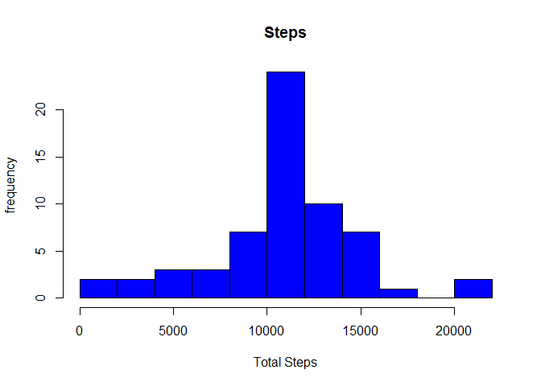
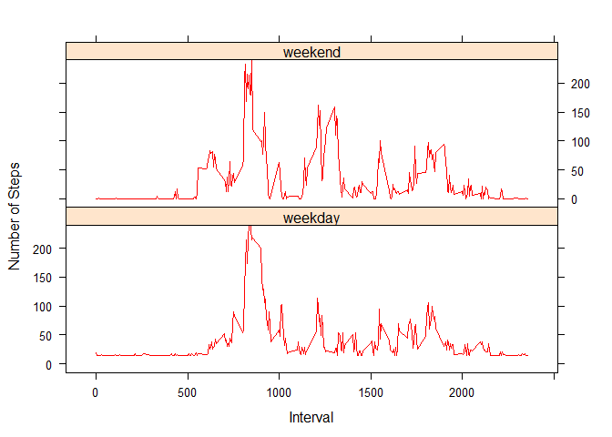

----
output: 
  html_document: 
    keep_md: yes
----
Coursera Project File: PA1_Template.Rmd
========================
##Garrett Richardson
##PA1_Template.Rmd
##Source File: "Activity.csv"

This is my first R markdown project

Loading and preprocessing the data

Load the file, "activity.csv" in R

```r
data <- read.csv("activity.csv", header=T)
```

Remove NA values from the file

```r
data <- na.omit(data)
```

Create a histogram of the total total number of steps take per day.

```r
steps_day <- tapply(data$steps, data$date, sum)
hist(steps_day, main = "Steps", ylab="frequency", 
     xlab="Total Steps", col="blue", breaks=10)
```

<!-- -->

The histogram appears to have a somewhat normal curve.

Find the mean and median number of steps taken each day


A time series plot of the average number of steps
<!-- -->

Find the interval containing the maximum number of steps

```
## [1] 835
```
Create code to impute missing data

```
## [1] 2304
```
Histogram of total number of steps from imputed data
<!-- -->


The imputed data looks similar to the non-imputed data.

Avg number of steps panel plot of weekends vs weekdays 
<!-- -->


This weekend vs weekday looks similar.
