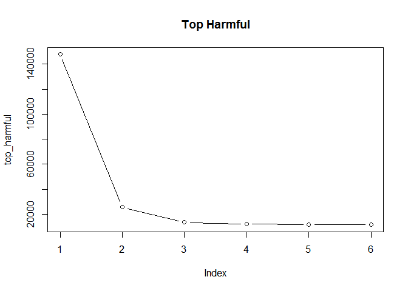
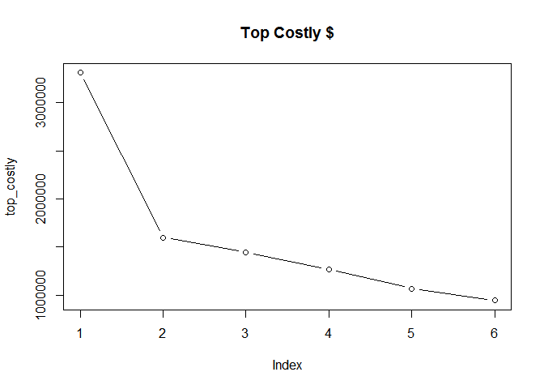

#Title - Storm Data Analysis
##This report lays out the most costly and deadly storm event types in the United States from January of 1950 until November of 2011.


##Synopsis
###The Data in the following code (once it has been read in) will be manipulated in such a way as to produce a list and graph of the most deadly and economically destructive weather events by type.  This will be accomplished by assigning a third variable to both economic damanage and human damage, quantifying injuries relative to death.  Human injuries will be increased by a multiple of ten and and added to human deaths to create the third variable.  Moreover, crop damage and property damange will be added together to creat the third variable.  Each type of desstructive assessment will be based on these two new variables.  

##Data Processing
###Read in datafile csv.bz2
###Load file directly from csv.bz2 folder
###We used a head() function to get an idea of the scope of the data

```r
data <- read.csv("repdata-data-StormData.csv.bz2", header=TRUE) 
head(data)
```

```
##   STATE__           BGN_DATE BGN_TIME TIME_ZONE COUNTY COUNTYNAME STATE
## 1       1  4/18/1950 0:00:00     0130       CST     97     MOBILE    AL
## 2       1  4/18/1950 0:00:00     0145       CST      3    BALDWIN    AL
## 3       1  2/20/1951 0:00:00     1600       CST     57    FAYETTE    AL
## 4       1   6/8/1951 0:00:00     0900       CST     89    MADISON    AL
## 5       1 11/15/1951 0:00:00     1500       CST     43    CULLMAN    AL
## 6       1 11/15/1951 0:00:00     2000       CST     77 LAUDERDALE    AL
##    EVTYPE BGN_RANGE BGN_AZI BGN_LOCATI END_DATE END_TIME COUNTY_END
## 1 TORNADO         0                                               0
## 2 TORNADO         0                                               0
## 3 TORNADO         0                                               0
## 4 TORNADO         0                                               0
## 5 TORNADO         0                                               0
## 6 TORNADO         0                                               0
##   COUNTYENDN END_RANGE END_AZI END_LOCATI LENGTH WIDTH F MAG FATALITIES
## 1         NA         0                      14.0   100 3   0          0
## 2         NA         0                       2.0   150 2   0          0
## 3         NA         0                       0.1   123 2   0          0
## 4         NA         0                       0.0   100 2   0          0
## 5         NA         0                       0.0   150 2   0          0
## 6         NA         0                       1.5   177 2   0          0
##   INJURIES PROPDMG PROPDMGEXP CROPDMG CROPDMGEXP WFO STATEOFFIC ZONENAMES
## 1       15    25.0          K       0                                    
## 2        0     2.5          K       0                                    
## 3        2    25.0          K       0                                    
## 4        2     2.5          K       0                                    
## 5        2     2.5          K       0                                    
## 6        6     2.5          K       0                                    
##   LATITUDE LONGITUDE LATITUDE_E LONGITUDE_ REMARKS REFNUM
## 1     3040      8812       3051       8806              1
## 2     3042      8755          0          0              2
## 3     3340      8742          0          0              3
## 4     3458      8626          0          0              4
## 5     3412      8642          0          0              5
## 6     3450      8748          0          0              6
```

##Data Transformation and Manipulation (Harmful)

##Create and sum a variable of total fatalities

```r
sum <- sum(data$FATALITIES)
total_fatalities <- tapply(data$FATALITIES, data$EVTYPE, sum)
```
##Display total fatalities variable

##Find and display the weather event type that has the most fatalities.

```r
max_fatalities <- max(total_fatalities)
print(max_fatalities)
```

```
## [1] 5633
```
##Create and sum a variable of total injuries

```r
total_injuries <- tapply(data$INJURIES, data$EVTYPE, sum)
```
##Find and display the weather event type that has the most injuries.

```r
max_injuries <- max(total_injuries)
print(max_injuries)
```

```
## [1] 91346
```
##Create a new variable wich creates a relative value for fatalities. ie, one fataltiy would be equal to 10 injuries.

```r
magnitude_fatalities <- total_fatalities*10
```
##Create a new variable called "harmful" wich combines total injuries and magntitud fatalities variable.

```r
harmful <- (magnitude_fatalities + total_injuries)
```
##Add this new variable, "harmful", to the dataframe and display the 'head' for reference.

```r
data_with_harmful <- data
data_with_harmful$harmful <- data$FATALITIES*10 + data$INJURIES
head(data_with_harmful)
```

```
##   STATE__           BGN_DATE BGN_TIME TIME_ZONE COUNTY COUNTYNAME STATE
## 1       1  4/18/1950 0:00:00     0130       CST     97     MOBILE    AL
## 2       1  4/18/1950 0:00:00     0145       CST      3    BALDWIN    AL
## 3       1  2/20/1951 0:00:00     1600       CST     57    FAYETTE    AL
## 4       1   6/8/1951 0:00:00     0900       CST     89    MADISON    AL
## 5       1 11/15/1951 0:00:00     1500       CST     43    CULLMAN    AL
## 6       1 11/15/1951 0:00:00     2000       CST     77 LAUDERDALE    AL
##    EVTYPE BGN_RANGE BGN_AZI BGN_LOCATI END_DATE END_TIME COUNTY_END
## 1 TORNADO         0                                               0
## 2 TORNADO         0                                               0
## 3 TORNADO         0                                               0
## 4 TORNADO         0                                               0
## 5 TORNADO         0                                               0
## 6 TORNADO         0                                               0
##   COUNTYENDN END_RANGE END_AZI END_LOCATI LENGTH WIDTH F MAG FATALITIES
## 1         NA         0                      14.0   100 3   0          0
## 2         NA         0                       2.0   150 2   0          0
## 3         NA         0                       0.1   123 2   0          0
## 4         NA         0                       0.0   100 2   0          0
## 5         NA         0                       0.0   150 2   0          0
## 6         NA         0                       1.5   177 2   0          0
##   INJURIES PROPDMG PROPDMGEXP CROPDMG CROPDMGEXP WFO STATEOFFIC ZONENAMES
## 1       15    25.0          K       0                                    
## 2        0     2.5          K       0                                    
## 3        2    25.0          K       0                                    
## 4        2     2.5          K       0                                    
## 5        2     2.5          K       0                                    
## 6        6     2.5          K       0                                    
##   LATITUDE LONGITUDE LATITUDE_E LONGITUDE_ REMARKS REFNUM harmful
## 1     3040      8812       3051       8806              1      15
## 2     3042      8755          0          0              2       0
## 3     3340      8742          0          0              3       2
## 4     3458      8626          0          0              4       2
## 5     3412      8642          0          0              5       2
## 6     3450      8748          0          0              6       6
```
##Create a variable 'total harmful' which sums by event type.

```r
total_harmful <- tapply(data_with_harmful$harmful, data_with_harmful$EVTYPE, sum)
```
###Create a list in decreasing order of the most harmful weather types and display. This list will display the six most harmful weather event types.

```r
descending_sort_harmful <- sort(total_harmful, decreasing = TRUE)
top_harmful <- head(descending_sort_harmful)
print(top_harmful)
```

```
##        TORNADO EXCESSIVE HEAT      LIGHTNING      TSTM WIND    FLASH FLOOD 
##         147676          25555          13390          11997          11557 
##          FLOOD 
##          11489
```
###Key for weather event type (Index):
####1:Toronado
####2:Excessive Heat
####3:Lightning
####4:Thunderstorm Wind
####5:Flash Flood
####6:Flood

##Plot the most harmful weather event types.  Top 6 in descending order.

```r
plot(top_harmful, type="b", main='Top Harmful')
```




##Data Transformation and Manipulation (Destructful)

```r
data_with_damage <- data
```
###Create a total property damage variables

```r
total_prop_damange <- tapply(data$PROPDMG, data$EVTYPE, sum)
```
##Find the maximum property damage

```r
max_prop_damage <- max(total_prop_damange)
max_prop_damage
```

```
## [1] 3212258
```

```r
total_crop_damage <- tapply(data$CROPDMG, data$EVTYPE, sum)
```
##Create total injuries variable

```r
max_injuries <- max(total_injuries)
print(max_injuries)
```

```
## [1] 91346
```
##Add this new variable, "costly", to the dataframe.

```r
data_with_damage$costly <- data$PROPDMG + data$CROPDMG
head(data_with_damage$costly)
```

```
## [1] 25.0  2.5 25.0  2.5  2.5  2.5
```

```r
total_costly <- tapply(data_with_damage$costly, data_with_damage$EVTYPE, sum)
```
###Create a list in decreasing order of the most costly weather types.

```r
descending_sort_costly <- sort(total_costly, decreasing = TRUE)
top_costly <- head(descending_sort_costly)
print(top_costly)
```

```
##           TORNADO       FLASH FLOOD         TSTM WIND              HAIL 
##         3312276.7         1599325.1         1445168.2         1268289.7 
##             FLOOD THUNDERSTORM WIND 
##         1067976.4          943635.6
```
###Key for weather event type (Index):
####1:Toronado
####2:Excessive Heat
####3:Lightning
####4:Thunderstorm Wind
####5:Flash Flood
####6:Flood


##Plot the most costly weather event types, top 6 in descending order.

```r
plot(top_costly, type="b", main='Top Costly $')
```




#Results
##Here is a list of both top costly and top harmful weather event types. It's clear that toronados are the most destructive weather event type for both cost and human life.
##Costly

```r
print(top_costly)
```

```
##           TORNADO       FLASH FLOOD         TSTM WIND              HAIL 
##         3312276.7         1599325.1         1445168.2         1268289.7 
##             FLOOD THUNDERSTORM WIND 
##         1067976.4          943635.6
```
##Harmful

```r
print(top_harmful)
```

```
##        TORNADO EXCESSIVE HEAT      LIGHTNING      TSTM WIND    FLASH FLOOD 
##         147676          25555          13390          11997          11557 
##          FLOOD 
##          11489
```
